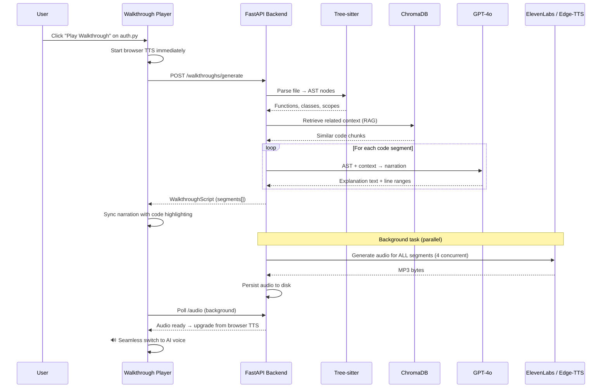
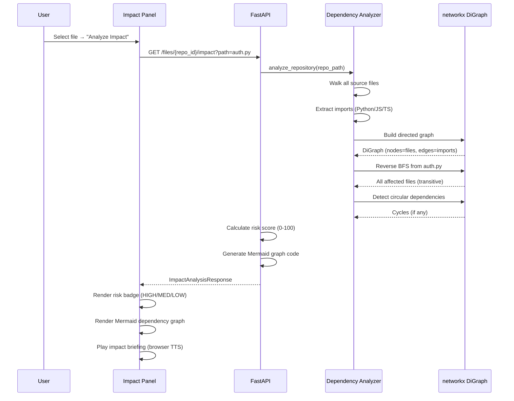
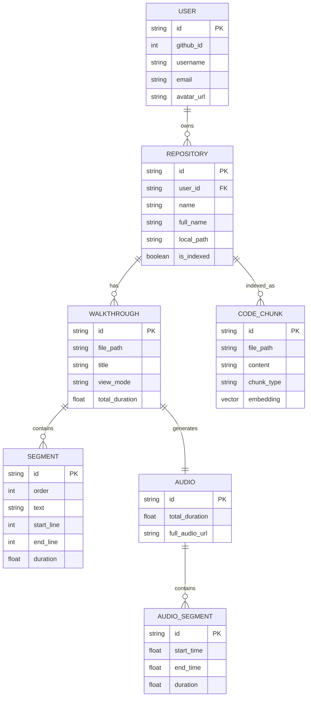

<div align="center">

# DocuVerse AI 🎬

### The World's First Generative Media Documentation Engine

**Stop reading code. Start watching it.**

[](https://nextjs.org/)
[](https://fastapi.tiangolo.com/)
[](https://openai.com/)
[](https://typescriptlang.org/)
[](https://python.org/)
[](https://www.trychroma.com/)

<br/>

> *Connect any GitHub repository → AI parses every file with Tree-sitter → LLM generates narrated walkthroughs → Press Play and watch code explain itself with synced audio, auto-scrolling, and live highlighting — like a YouTube video for your codebase.*

</div>

---

## 🧠 The Problem

| Pain Point | Impact |
|---|---|
| New developers spend **~58% of their time** just understanding existing code | Slow onboarding, lost productivity |
| Code documentation is always outdated or nonexistent | Knowledge silos, bus-factor risk |
| Static docs (Markdown, Javadoc) can't convey **flow and reasoning** | Context is lost between files |
| No tool answers the real question: *"Walk me through this code"* | Engineers ask seniors → blocks everyone |

## 💡 Our Solution: Auto-Cast

DocuVerse introduces **Auto-Cast** — the first YouTube-style playback engine for source code.

```
You select a file  →  AI understands it  →  Press ▶ Play  →  An AI Senior Engineer narrates
                                                               while the code auto-scrolls,
                                                               highlights line-by-line, and
                                                               diagrams render in real-time.
```

**It's not a chatbot. It's not a static doc generator. It's a cinematic code walkthrough.**

---

## ✨ Key Features

### 🎙️ Auto-Cast Walkthrough Player
The flagship feature. A fully custom audio-synced code player:
- **AI-generated narration** — LLM writes segment-by-segment explanations referencing exact line ranges
- **Dual audio engine** — ElevenLabs/Edge-TTS for premium AI voice; instant browser TTS fallback (zero wait)
- **Real-time sync** — Audio playback is married to code highlighting. As the narrator speaks about lines 42–58, those lines auto-scroll into view and glow
- **Full playback controls** — Play / Pause / Skip / Seek / Speed (0.5x–2x) / Mute
- **Two view modes** — *Developer Mode* (inputs, outputs, complexity, edge cases) and *Manager Mode* (business-level summary)

### 📊 Auto-Generated Diagrams
- One click → **Mermaid.js diagrams** rendered from actual code structure
- Supports **Flowcharts**, **Class Diagrams**, **Sequence Diagrams**, **ER Diagrams**
- Powered by AST analysis, not guesswork

### 🔬 Change Impact Simulator
- *"If I change this file, what breaks?"* — answered instantly
- Builds a **networkx Directed Acyclic Graph** from all imports across the codebase
- Computes **risk scores (0–100)**, identifies **hotspot files**, detects **circular dependencies**
- Generates interactive **dependency graphs** with Mermaid.js
- **Zero LLM calls** — pure graph algorithms, runs in < 2 seconds

### 🧪 Live Sandbox
- Execute code snippets directly in the browser
- Inject variables, test edge cases, validate assumptions
- Supports **Python** and **JavaScript**
- Isolated execution environment with timeout protection

### 📝 MNC-Standard Documentation Generator
- Generates **complete repository documentation** — overview, architecture, dependencies, per-file docs
- GPT-4o-mini for per-file docs (fast & cheap), GPT-4o for high-level summaries
- Parallel generation with concurrency control (6 files at once)
- Persistent caching — documentation survives server restarts

### 🔐 GitHub-Native Authentication
- One-click GitHub OAuth sign-in
- Automatic repository listing from your GitHub account
- JWT-based session management with 30-day persistence
- Supports private repositories

---

## 🏗️ System Architecture

```
┌─────────────────────────────────────────────────────────────────────┐
│                        DOCUVERSE AI                                 │
├──────────────┬──────────────────────┬───────────────────────────────┤
│              │                      │                               │
│  INGESTION   │   LOGIC ENGINE       │   PRESENTATION LAYER          │
│              │                      │                               │
│  ┌─────────┐ │  ┌────────────────┐  │  ┌─────────────────────────┐  │
│  │ GitHub  │ │  │ ChromaDB       │  │  │ Walkthrough Player      │  │
│  │ Clone   │ │  │ Vector Store   │  │  │ • Audio-code sync       │  │
│  └────┬────┘ │  └───────┬────────┘  │  │ • Auto-scroll           │  │
│       │      │          │           │  │ • Line highlighting     │  │
│  ┌────▼────┐ │  ┌───────▼────────┐  │  │ • Playback controls     │  │
│  │ Tree-   │ │  │ GPT-4o         │  │  └─────────────────────────┘  │
│  │ sitter  │ │  │ Script Gen     │  │                               │
│  │ Parser  │ │  │ + RAG Context  │  │  ┌─────────────────────────┐  │
│  └────┬────┘ │  └───────┬────────┘  │  │ Mermaid.js Diagrams     │  │
│       │      │          │           │  └─────────────────────────┘  │
│  ┌────▼────┐ │  ┌───────▼────────┐  │                               │
│  │ AST     │ │  │ ElevenLabs /   │  │  ┌─────────────────────────┐  │
│  │ Chunks  │ │  │ Edge-TTS /     │  │  │ Impact Simulator        │  │
│  │ + Index │ │  │ Browser TTS    │  │  │ • Dependency DAG        │  │
│  └─────────┘ │  └────────────────┘  │  │ • Risk scoring          │  │
│              │                      │  └─────────────────────────┘  │
│  ┌─────────┐ │  ┌────────────────┐  │                               │
│  │ Dep.    │ │  │ Documentation  │  │  ┌─────────────────────────┐  │
│  │ Graph   │ │  │ Generator      │  │  │ Live Sandbox            │  │
│  │ (DAG)   │ │  │ (GPT-4o)      │  │  │ • Python / JS runtime   │  │
│  └─────────┘ │  └────────────────┘  │  └─────────────────────────┘  │
│              │                      │                               │
└──────────────┴──────────────────────┴───────────────────────────────┘
```

### Three-Layer Pipeline

| Layer | What It Does | Key Technology |
|-------|-------------|----------------|
| **1. Ingestion** | Clones repos, parses every file into AST nodes, builds dependency graphs, creates vector embeddings | Tree-sitter, ChromaDB, networkx |
| **2. Logic** | Takes AST + RAG context → generates narrated scripts, diagrams, risk analysis, documentation | GPT-4o, LangChain, RAG |
| **3. Presentation** | Renders everything in a cinematic player with synced audio, diagrams, sandbox | Next.js, Framer Motion, Mermaid.js |

---

## 🔄 Data Flow

### Complete Request Lifecycle

```mermaid
flowchart TB
    subgraph Client["🖥️ Frontend — Next.js 14"]
        UI[React UI + Zustand State]
        Player[Walkthrough Player]
        FileExp[File Explorer]
        Sandbox[Live Sandbox]
        Diagrams[Mermaid Diagrams]
        Impact[Impact Simulator]
    end

    subgraph API["⚡ Backend — FastAPI"]
        Auth[Auth Service]
        RepoMgr[Repository Manager]
        Parser[Tree-sitter Parser]
        ScriptGen[Script Generator]
        AudioGen[Audio Generator]
        DiagramGen[Diagram Generator]
        DepAnalyzer[Dependency Analyzer]
        DocGen[Documentation Generator]
        SandboxExec[Sandbox Executor]
    end

    subgraph Storage["💾 Data Layer"]
        ChromaDB[(ChromaDB Vector Store)]
        FileSystem[(Local File System)]
        Persistence[(JSON Persistence)]
    end

    subgraph External["🌐 External Services"]
        GitHub[GitHub API + OAuth]
        OpenAI[OpenAI GPT-4o]
        TTS[ElevenLabs / Edge-TTS]
    end

    UI --> Auth
    UI --> RepoMgr
    Player --> ScriptGen
    Player --> AudioGen
    FileExp --> RepoMgr
    Sandbox --> SandboxExec
    Diagrams --> DiagramGen
    Impact --> DepAnalyzer

    Auth --> GitHub
    RepoMgr --> GitHub
    RepoMgr --> FileSystem
    Parser --> ChromaDB
    ScriptGen --> OpenAI
    ScriptGen --> ChromaDB
    AudioGen --> TTS
    DocGen --> OpenAI
    DepAnalyzer --> FileSystem

    Persistence --> FileSystem

    style Client fill:#0d1117,stroke:#58a6ff,stroke-width:2px
    style API fill:#0d1117,stroke:#a371f7,stroke-width:2px
    style Storage fill:#0d1117,stroke:#3fb950,stroke-width:2px
    style External fill:#0d1117,stroke:#d29922,stroke-width:2px
```



### Walkthrough Generation Flow (Core)



### Change Impact Analysis Flow



---

## 🛠️ Tech Stack

| Layer | Technology | Purpose |
|-------|-----------|---------|
| **Frontend** | Next.js 14, React 18, TypeScript | App framework with App Router |
| **State** | Zustand + React Query | Client state + server cache |
| **UI** | Tailwind CSS, Framer Motion, Radix UI | Styling, animation, accessible primitives |
| **Diagrams** | Mermaid.js 10.6 | Client-side diagram rendering |
| **Syntax** | Prism React Renderer | Code syntax highlighting |
| **Backend** | FastAPI, Python 3.10+ | Async API with background tasks |
| **AI/LLM** | LangChain + GPT-4o / GPT-4o-mini | Script generation, documentation |
| **TTS** | ElevenLabs → Edge-TTS → Browser TTS | Three-tier audio fallback chain |
| **Parsing** | Tree-sitter | Language-agnostic AST extraction |
| **Vector DB** | ChromaDB | Semantic code search (RAG) |
| **Graph** | networkx | Dependency DAG + impact analysis |
| **Auth** | GitHub OAuth + JWT (jose) | Secure authentication |
| **Persistence** | JSON file-based | Walkthroughs, audio, docs survive restarts |

---

## 📐 API Contracts

### Base URL
```
http://localhost:8000/api
```

All authenticated endpoints require: `Authorization: Bearer <jwt_token>`

### Authentication

| Method | Endpoint | Description |
|--------|----------|-------------|
| `GET` | `/auth/github` | Initiate GitHub OAuth flow → returns `auth_url` |
| `GET` | `/auth/github/callback` | OAuth callback → creates JWT session |
| `GET` | `/auth/me` | Get current authenticated user profile |

### Repositories

| Method | Endpoint | Description |
|--------|----------|-------------|
| `GET` | `/repositories/github` | List repos from user's GitHub account |
| `POST` | `/repositories/connect` | Clone & connect a repo `{ "full_name": "user/repo" }` |
| `GET` | `/repositories/` | List all connected repositories |
| `GET` | `/repositories/{id}` | Get single repository details |
| `POST` | `/repositories/{id}/index` | Trigger Tree-sitter parsing + ChromaDB indexing |
| `DELETE` | `/repositories/{id}` | Remove repository and all data |

### File Analysis

| Method | Endpoint | Description |
|--------|----------|-------------|
| `GET` | `/files/{repo_id}/tree` | Recursive file tree with language detection |
| `GET` | `/files/{repo_id}/content?path=` | Raw file content |
| `GET` | `/files/{repo_id}/ast?path=` | Tree-sitter AST (functions, classes, scopes) |
| `GET` | `/files/{repo_id}/dependencies` | Full dependency graph (nodes + edges) |
| `GET` | `/files/{repo_id}/impact?path=&symbol=` | Single-file impact analysis with risk score |
| `GET` | `/files/{repo_id}/impact/codebase` | Full codebase impact — hotspots, risk map |

### Walkthroughs (Auto-Cast)

| Method | Endpoint | Description |
|--------|----------|-------------|
| `POST` | `/walkthroughs/generate` | Generate AI walkthrough `{ repository_id, file_path, view_mode }` |
| `GET` | `/walkthroughs/{id}` | Get walkthrough script with segments |
| `GET` | `/walkthroughs/{id}/audio` | Audio metadata (202 while generating, 200 when ready) |
| `GET` | `/walkthroughs/{id}/audio/stream` | Stream MP3 audio file |
| `GET` | `/walkthroughs/file/{repo_id}?file_path=` | Get all walkthroughs for a file |
| `DELETE` | `/walkthroughs/{id}` | Delete walkthrough + audio |

### Documentation

| Method | Endpoint | Description |
|--------|----------|-------------|
| `POST` | `/documentation/{repo_id}/generate` | Generate full repo docs (background) |
| `GET` | `/documentation/{repo_id}` | Get generated docs (202/404/200) |
| `GET` | `/documentation/{repo_id}/file?path=` | Generate docs for single file (on-demand) |

### Diagrams

| Method | Endpoint | Description |
|--------|----------|-------------|
| `POST` | `/diagrams/generate` | Generate Mermaid diagram `{ repository_id, diagram_type, file_path }` |
| `GET` | `/diagrams/{id}` | Get diagram by ID |

### Sandbox

| Method | Endpoint | Description |
|--------|----------|-------------|
| `POST` | `/sandbox/execute` | Execute code `{ code, language, variables }` |
| `GET` | `/sandbox/languages` | List supported languages |
| `POST` | `/sandbox/validate` | Validate code safety without executing |

<details>
<summary><b>📋 Example: Generate Walkthrough Request / Response</b></summary>

**Request:**
```json
POST /api/walkthroughs/generate
{
  "repository_id": "repo_abc123",
  "file_path": "src/auth/auth_flow.py",
  "view_mode": "developer"
}
```

**Response:**
```json
{
  "id": "wt_xyz789",
  "file_path": "src/auth/auth_flow.py",
  "title": "Walkthrough: Authentication Flow",
  "summary": "Technical walkthrough covering the OAuth authentication pipeline...",
  "view_mode": "developer",
  "segments": [
    {
      "id": "seg_001",
      "order": 0,
      "text": "Let's start with the imports. Lines 1 through 8 bring in FastAPI's routing utilities and the OAuth library...",
      "start_line": 1,
      "end_line": 8,
      "highlight_lines": [1, 2, 3, 5, 8],
      "duration_estimate": 12.5,
      "code_context": "import FastAPI, OAuth2..."
    }
  ],
  "total_duration": 245.0,
  "created_at": "2026-02-22T10:30:00Z",
  "metadata": { "repository_id": "repo_abc123" }
}
```
</details>

<details>
<summary><b>📋 Example: Impact Analysis Response</b></summary>

```json
{
  "target_file": "src/lib/api.ts",
  "symbol": "fetchUser",
  "direct_dependents": ["src/app/dashboard/page.tsx", "src/components/UserCard.tsx"],
  "affected_files": ["src/app/dashboard/page.tsx", "src/components/UserCard.tsx", "src/app/layout.tsx"],
  "total_affected": 3,
  "dependency_chain": { "level_1": ["src/lib/utils.ts"], "level_2": [] },
  "circular_dependencies": [],
  "risk_score": 49,
  "risk_level": "medium",
  "recommended_refactor_steps": [
    "Create a short-lived feature branch",
    "Update fetchUser signature in api.ts",
    "Update all 2 direct dependents",
    "Run test suite before merging"
  ],
  "brief_script": "Impact briefing for fetchUser in src/lib/api.ts...",
  "impact_mermaid": "flowchart LR\n    target[\"lib/api.ts\"]..."
}
```
</details>

---

## 🚀 Quick Start

### Prerequisites
- **Python 3.10+** with pip
- **Node.js 18+** with npm
- **OpenAI API key** (for GPT-4o)
- **GitHub OAuth App** (for auth — create at github.com/settings/developers)

### 1. Clone the Repository
```bash
git clone https://github.com/your-org/DocuVerse-Ai.git
cd DocuVerse-Ai
```

### 2. Backend Setup

<details>
<summary><b>🪟 Windows (PowerShell)</b></summary>

```powershell
cd backend
python -m venv venv
.\venv\Scripts\Activate.ps1
pip install -r requirements.txt
Copy-Item .env.example .env     # Then edit .env with your keys
uvicorn app.main:app --reload --port 8000
```
</details>

<details>
<summary><b>🐧 Linux / macOS</b></summary>

```bash
cd backend
python -m venv venv
source venv/bin/activate
pip install -r requirements.txt
cp .env.example .env            # Then edit .env with your keys
uvicorn app.main:app --reload --port 8000
```
</details>

### 3. Frontend Setup
```bash
cd frontend
npm install
npm run dev
```

### 4. Environment Variables

Create `backend/.env`:
```env
# Authentication
SECRET_KEY=your-secret-key
GITHUB_CLIENT_ID=your-github-client-id
GITHUB_CLIENT_SECRET=your-github-client-secret
GITHUB_REDIRECT_URI=http://localhost:3000/api/auth/callback/github

# AI
OPENAI_API_KEY=sk-...

# Premium TTS (optional — Edge-TTS is free fallback)
ELEVENLABS_API_KEY=                         # Leave empty for free Edge-TTS
ELEVENLABS_VOICE_ID=21m00Tcm4TlvDq8ikWAM

# Storage
CHROMA_PERSIST_DIRECTORY=./chroma_db
REPOS_DIRECTORY=./repos
```

### 5. Open the App

| Service | URL |
|---------|-----|
| Frontend | http://localhost:3000 |
| Backend API | http://localhost:8000/api |
| Swagger Docs | http://localhost:8000/api/docs |
| ReDoc | http://localhost:8000/api/redoc |

---

## 📁 Project Structure

```
DocuVerse-Ai/
│
├── backend/                          # FastAPI + Python AI Pipeline
│   ├── app/
│   │   ├── main.py                   # App factory, CORS, lifespan
│   │   ├── config.py                 # Pydantic settings from .env
│   │   ├── api/
│   │   │   ├── routes.py             # Route aggregator
│   │   │   └── endpoints/
│   │   │       ├── auth.py           # GitHub OAuth + JWT
│   │   │       ├── repositories.py   # Clone, index, manage repos
│   │   │       ├── files.py          # File tree, AST, impact analysis
│   │   │       ├── walkthroughs.py   # Auto-Cast generation + audio
│   │   │       ├── documentation.py  # MNC-standard doc generation
│   │   │       ├── diagrams.py       # Mermaid diagram generation
│   │   │       └── sandbox.py        # Isolated code execution
│   │   ├── services/
│   │   │   ├── parser.py             # Tree-sitter AST (6 languages)
│   │   │   ├── vector_store.py       # ChromaDB embeddings
│   │   │   ├── script_generator.py   # LangChain + GPT-4o narration
│   │   │   ├── audio_generator.py    # ElevenLabs → Edge-TTS → fallback
│   │   │   ├── documentation_generator.py  # Parallel GPT-4o docs
│   │   │   ├── diagram_generator.py  # Mermaid code generation
│   │   │   ├── dependency_analyzer.py # networkx DAG + impact
│   │   │   ├── indexer.py            # Repo file walker + indexer
│   │   │   └── persistence.py        # JSON file persistence layer
│   │   └── models/
│   │       └── schemas.py            # 60+ Pydantic models
│   ├── chroma_db/                    # ChromaDB persistent storage
│   ├── repos/                        # Cloned repositories
│   │   └── .persistence/             # Persisted walkthroughs, audio, docs
│   └── requirements.txt
│
├── frontend/                         # Next.js 14 + TypeScript
│   ├── src/
│   │   ├── app/
│   │   │   ├── page.tsx              # Landing page
│   │   │   ├── dashboard/            # Repository dashboard
│   │   │   ├── repository/[id]/
│   │   │   │   └── walkthrough/      # Main walkthrough experience
│   │   │   ├── auth/                 # GitHub sign-in flow
│   │   │   ├── walkthroughs/         # Walkthrough history
│   │   │   └── settings/             # User preferences
│   │   ├── components/
│   │   │   ├── walkthrough/
│   │   │   │   ├── WalkthroughPlayer.tsx  # Core audio-synced player
│   │   │   │   ├── FileExplorer.tsx       # Repo file browser
│   │   │   │   ├── DiagramPanel.tsx       # Mermaid rendering
│   │   │   │   ├── SandboxPanel.tsx       # Code execution
│   │   │   │   └── ImpactPanel.tsx        # Impact analysis UI
│   │   │   ├── dashboard/
│   │   │   └── layout/
│   │   └── lib/
│   │       ├── api.ts                # Type-safe API client (6 modules)
│   │       ├── store.ts              # Zustand stores (4 stores)
│   │       └── utils.ts
│   ├── tailwind.config.ts
│   └── package.json
│
└── docs/
    ├── API_CONTRACTS.md              # Full API documentation
    ├── DATA_FLOW.md                  # Architecture + sequence diagrams
    └── IMPACT_FEATURES.md            # Impact Simulator deep-dive
```

---

## 🎯 User Journey

```
┌──────────┐     ┌──────────┐     ┌──────────┐     ┌──────────┐     ┌──────────┐
│          │     │          │     │          │     │          │     │          │
│ CONNECT  │────▶│ ANALYZE  │────▶│ EXPLORE  │────▶│ PLAY     │────▶│ VERIFY   │
│          │     │          │     │          │     │          │     │          │
│ GitHub   │     │ Clone +  │     │ File     │     │ Auto-Cast│     │ Sandbox  │
│ OAuth    │     │ Tree-    │     │ Explorer │     │ Player   │     │ + Impact │
│ Sign In  │     │ sitter   │     │ + AST    │     │ ▶ Play   │     │ Analysis │
│          │     │ + Index  │     │ View     │     │          │     │          │
└──────────┘     └──────────┘     └──────────┘     └──────────┘     └──────────┘
```

1. **Connect** → Sign in with GitHub → select any repository (public or private)
2. **Analyze** → Backend clones the repo → Tree-sitter parses every file → ChromaDB indexes code chunks → Dependency graph is built
3. **Explore** → Browse the file tree → view syntax-highlighted code → inspect AST structure → see dependency connections
4. **Play** → Select a file → click "Generate Walkthrough" → AI voice narrates while code auto-scrolls and highlights in real-time
5. **Verify** → Run code in the Sandbox → analyze change impact → export diagrams → generate full documentation

---

## 🎨 Design Philosophy

| Aspect | Choice |
|--------|--------|
| **Theme** | Dark-first IDE aesthetic (GitHub Dark inspired) |
| **Typography** | DM Sans (UI) + JetBrains Mono (code) |
| **Motion** | Smooth 60fps animations via Framer Motion |
| **Surfaces** | Glass-morphism panels with subtle blur |
| **Accents** | Blue → Purple gradient system |
| **Interactions** | Radix UI primitives for accessibility |
| **State** | Zustand with localStorage persistence |

---

## 🧩 Data Models



---

## ⚡ Performance Optimizations

| Optimization | Detail |
|:----|:-------|
| **Parallel audio generation** | Up to 4 segments generated concurrently (4x faster) |
| **Parallel documentation** | 6 files documented concurrently via async semaphore |
| **Instant playback** | Browser TTS starts immediately; AI voice upgrades seamlessly in background |
| **RAG context** | ChromaDB retrieves only relevant chunks (not entire codebase) |
| **Persistent caching** | Walkthroughs, audio MP3s, documentation cached to disk — zero regeneration |
| **Three-tier TTS** | ElevenLabs (premium) → Edge-TTS (free) → Browser TTS (instant) |
| **Background tasks** | Audio generation runs as FastAPI BackgroundTask — non-blocking API |
| **Lazy service init** | Services created in lifespan, shared via `app.state` |

---

## 🤝 Contributing

```bash
# Fork → Clone → Branch
git checkout -b feature/amazing-feature

# Make changes → Test → Push
git push origin feature/amazing-feature

# Open a Pull Request
```

---

## 📄 License

This project is built for hackathon demonstration purposes.

---

<div align="center">

**Built with ❤️ by Team BitMask**

*Transforming the way developers understand code — one walkthrough at a time.*

</div>

