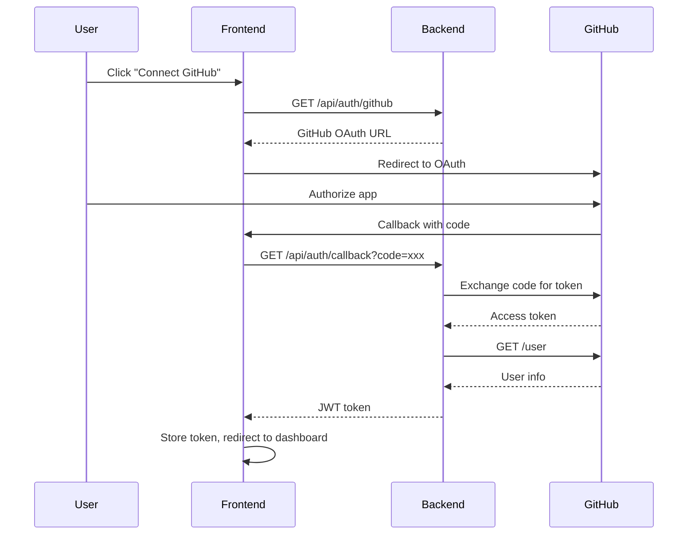
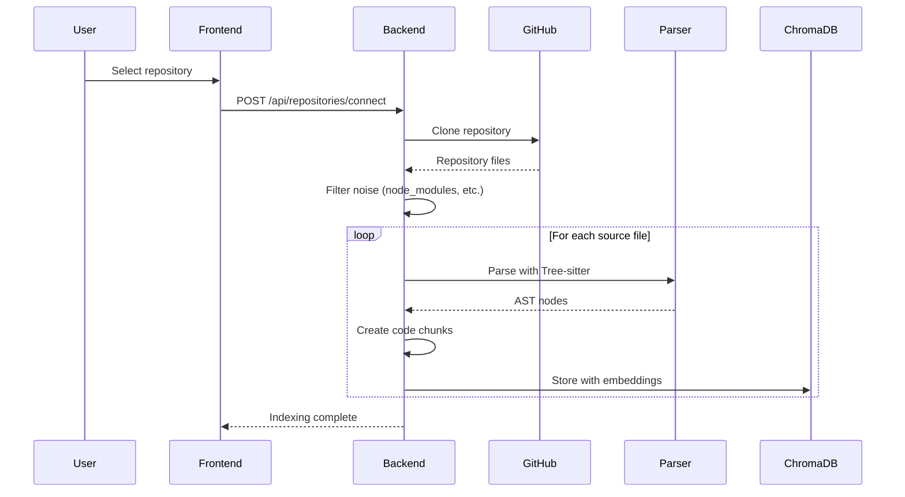
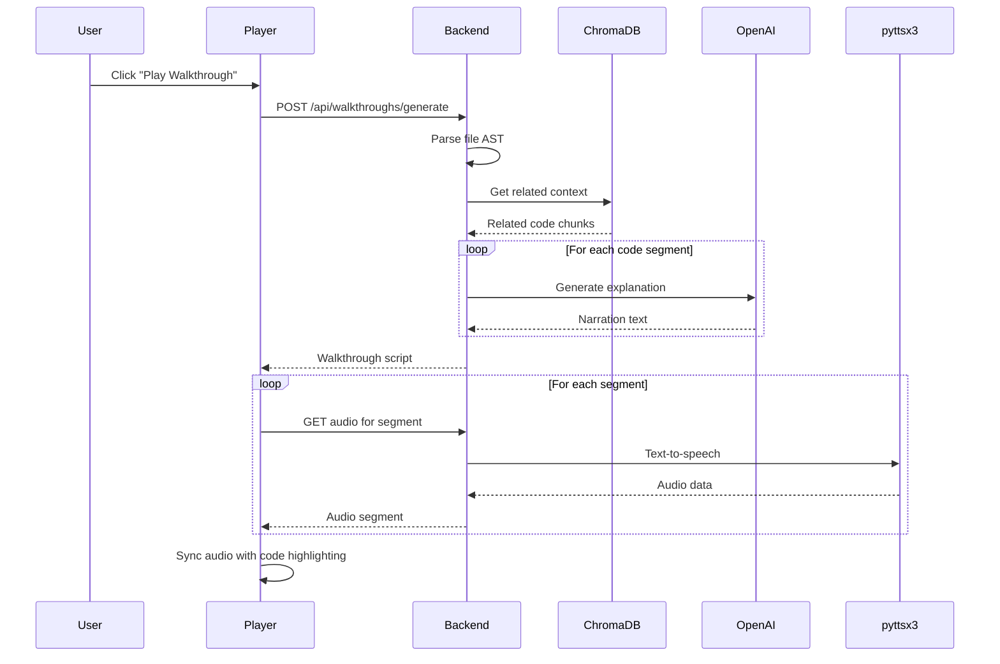
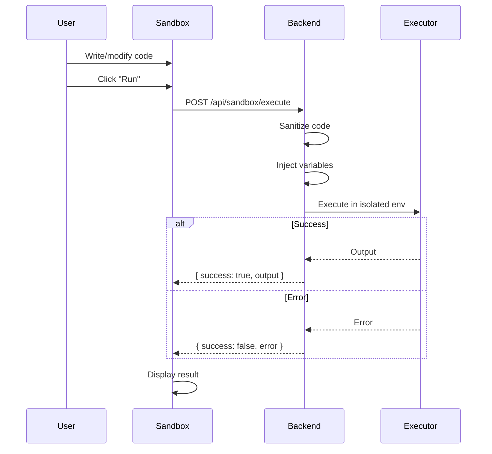
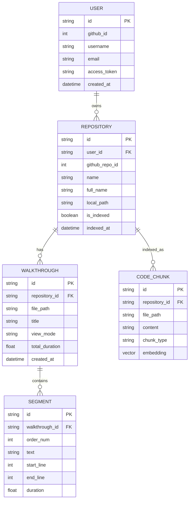

# DocuVerse Data Flow Diagram

## System Architecture Overview

```mermaid
flowchart TB
    subgraph Client["Frontend (Next.js)"]
        UI[React UI Components]
        Player[Walkthrough Player]
        FileExp[File Explorer]
        Sandbox[Live Sandbox]
        Diagrams[Mermaid Diagrams]
    end

    subgraph API["Backend (FastAPI)"]
        Auth[Auth Service]
        RepoMgr[Repository Manager]
        Parser[Tree-sitter Parser]
        ScriptGen[Script Generator]
        AudioGen[Audio Generator]
        DiagramGen[Diagram Generator]
        SandboxExec[Sandbox Executor]
    end

    subgraph Storage["Data Layer"]
        ChromaDB[(ChromaDB\nVector Store)]
        FileSystem[(Local\nFile System)]
        Redis[(Redis\nCache/Queue)]
    end

    subgraph External["External Services"]
        GitHub[GitHub API]
        OpenAI[OpenAI GPT-4o]
        pyttsx3[pyttsx3 TTS]
    end

    %% Client to API connections
    UI --> Auth
    UI --> RepoMgr
    Player --> ScriptGen
    Player --> AudioGen
    FileExp --> RepoMgr
    Sandbox --> SandboxExec
    Diagrams --> DiagramGen

    %% API to Storage
    Auth --> Redis
    RepoMgr --> FileSystem
    Parser --> ChromaDB
    ScriptGen --> ChromaDB

    %% API to External
    Auth --> GitHub
    RepoMgr --> GitHub
    ScriptGen --> OpenAI
    AudioGen --> pyttsx3

    style Client fill:#161b22,stroke:#58a6ff
    style API fill:#161b22,stroke:#a371f7
    style Storage fill:#161b22,stroke:#3fb950
    style External fill:#161b22,stroke:#d29922
```

## Detailed Data Flow

### 1. User Authentication Flow

### 2. Repository Indexing Flow

### 3. Walkthrough Generation Flow

### 4. Live Sandbox Execution Flow

## Component Interaction Matrix

| Component | Reads From | Writes To | External Deps |
|-----------|-----------|-----------|---------------|
| Auth Service | Redis | Redis | GitHub OAuth |
| Repository Manager | GitHub, FileSystem | FileSystem, ChromaDB | GitHub API |
| Parser Service | FileSystem | ChromaDB | Tree-sitter |
| Script Generator | ChromaDB | Memory | OpenAI GPT-4o |
| Audio Generator | Memory | FileSystem | pyttsx3 (local) |
| Diagram Generator | ChromaDB, FileSystem | Memory | None |
| Sandbox Executor | Memory | Memory | Python/Node runtime |

## Data Models

### Core Entities

## API Contract Summary

### Authentication
- `GET /api/auth/github` → OAuth initiation
- `GET /api/auth/github/callback` → OAuth callback
- `GET /api/auth/me` → Current user info

### Repositories
- `GET /api/repositories/github` → List GitHub repos
- `POST /api/repositories/connect` → Connect repo
- `GET /api/repositories/` → List connected repos
- `POST /api/repositories/{id}/index` → Index repo

### Files
- `GET /api/files/{repo_id}/tree` → File tree
- `GET /api/files/{repo_id}/content` → File content
- `GET /api/files/{repo_id}/ast` → AST analysis

### Walkthroughs
- `POST /api/walkthroughs/generate` → Generate walkthrough
- `GET /api/walkthroughs/{id}` → Get script
- `GET /api/walkthroughs/{id}/audio` → Get audio

### Diagrams
- `POST /api/diagrams/generate` → Generate diagram

### Sandbox
- `POST /api/sandbox/execute` → Run code
- `GET /api/sandbox/languages` → Supported languages

